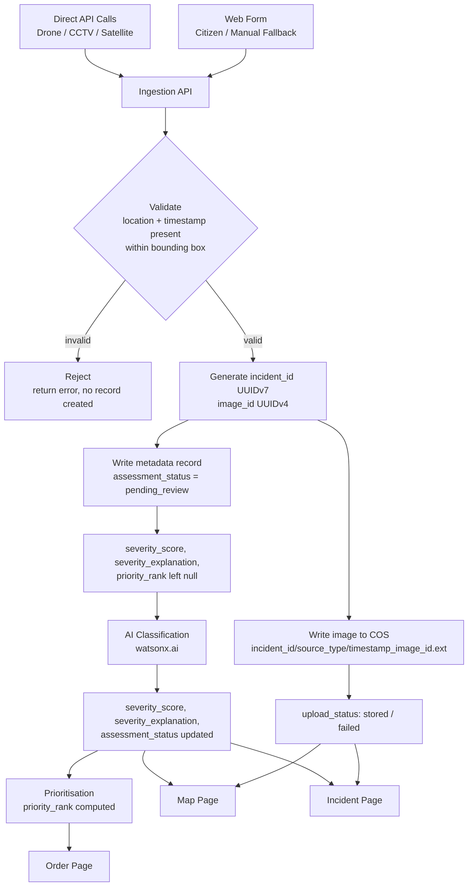

# Imagery Pipeline Architecture

## 1. Image Input Methods

There is a single ingestion API. Every image, regardless of source, enters the system through it. The web form is not a separate path, it is simply the client built for humans (citizens, or manual fallback entry) to call that API. Anyone else, such as a drone system, a CCTV integration, or a satellite pipeline, can call the same endpoint directly with whatever client they use.

| Client | Who uses it | How it fills the API |
|---|---|---|
| **Web form** | Citizen submissions, manual fallback for any source missing EXIF data | User attaches an image; if location or timestamp are not embedded, the form prompts for manual entry, then calls the ingestion API with the completed fields. |
| **Direct API calls** | Drone, CCTV, satellite (simulated for this project, no live integrations exist per the approved scope) | Each system calls the same endpoint on its own terms, posting the image plus pre-populated metadata (GPS, timestamp, source_type). No form, no manual step. |

The API does not care which client called it. It validates required fields, writes the image to COS, and writes the metadata record the same way regardless of source. The web form should still do its own front-end sanity checking on required fields before it ever calls the API, so a user finds out a field is wrong immediately rather than waiting on a round trip to the server. The API's own validation stays in place as the authoritative check, since automated clients bypass the form entirely and cannot rely on it. This means "multiple image input methods" is not multiple systems to build and maintain, it is one API with multiple front doors. Any work done for the ingestion-tier phase automatically applies no matter which client sent the image.

---

## 2. Metadata Field Types

Every image or video object ingested into the pipeline carries a companion metadata record. These fields support the four screens the BA specified: Image Submission, Map Page, Incident Page, and Order Page.

| Field | Type | Description | Screen(s) it supports |
|---|---|---|---|
| `incident_id` | string (UUIDv7) | Unique identifier grouping related detections at one location/event. Time-ordered so it sorts chronologically. | Map, Incident, Order |
| `image_id` | string (UUIDv4) | Unique identifier for the individual image/video object | Image Submission, Incident |
| `storage_path` | string | Full object key/path in COS where the file lives | Incident |
| `timestamp` | ISO 8601 datetime | When the image was captured, from EXIF metadata, or manually entered by the user if EXIF is missing | Image Submission, Incident |
| `source_type` | enum | `drone`, `cctv`, `citizen`, `satellite` | Image Submission, Incident |
| `latitude` / `longitude` | float (WGS84) | Geotagged location of the incident. Required before submission is accepted; user manually enters this if the image has no EXIF GPS data. | Map, Incident |
| `severity_score` | number or null | Output of the vision classifier (severity level 1 to 4 per the rubric), null until AI stage is built | Map, Incident, Order |
| `severity_explanation` | string or null | Human readable justification for the ranking, null until explainability stage is built | Incident |
| `assessment_status` | enum | `assessed`, `unable_to_assess`, `pending_review`. Tracks whether the AI could confidently tag the image, separate from whether the upload itself succeeded. | Map, Incident |
| `priority_rank` | integer or null | Position in the dispatch order, null until prioritisation logic exists | Order |
| `upload_status` | enum | `pending`, `stored`, `failed` | Image Submission |
| `ingestion_error` | string or null | Populated if upload fails, supports the error state on Image Submission screen | Image Submission |

---

## 3. Image and Metadata Flow

The flow is the same regardless of which client (web form or direct API call) initiated it, since both call the same ingestion API.

| Step | What happens | Fields involved |
|---|---|---|
| **1. Submission** | Client sends an image plus location, timestamp, and source_type, either manually entered or pre-populated by the sending system. | `source_type`, `latitude`/`longitude`, `timestamp` |
| **2. Validation** | API checks that location and timestamp are present and that coordinates fall within the operating region's bounding box. If either check fails, the submission is rejected immediately, no record is created. | (pre-write check) |
| **3. Storage write** | On a valid submission, `incident_id` and `image_id` are generated, and the image is written to COS at `/<incident_id>/<source_type>/<timestamp>_<image_id>.<ext>`. `upload_status` moves from `pending` to `stored` or `failed`. | `incident_id`, `image_id`, `storage_path`, `upload_status`, `ingestion_error` |
| **4. Metadata record created** | A metadata record is written to the metadata store (separate from the image itself), with `assessment_status` starting at `pending_review` and the AI-dependent fields left null. | `assessment_status`, `severity_score` (null), `severity_explanation` (null), `priority_rank` (null) |
| **5. AI classification** | The stored image is sent to the vision classifier automatically. Result updates `severity_score`, `severity_explanation`, and `assessment_status`. | `severity_score`, `severity_explanation`, `assessment_status` |
| **6. Prioritisation** | Once severity is known, `priority_rank` is computed against other open incidents. | `priority_rank` |
| **7. Consumption** | Map page reads coordinates, `severity_score`, and `assessment_status` for markers. Incident page joins the full record plus `storage_path` and `severity_explanation`. Order page reads `priority_rank`. | all fields, read-only |

---

## 4. Object / Folder Naming Structure

Object key convention in COS:

```
/<incident_id>/<source_type>/<timestamp>_<image_id>.<ext>
```

Example:

```
/inc-2026-0091/drone/2026-08-20T14-32-00_img-0007.jpg
```

**Rationale:**
- Grouping by `incident_id` first lets the severity map and Incident Page fetch all imagery for one location in a single prefix query.
- Sub-folder by `source_type` keeps citizen uploads, drone footage, and satellite tiles separable for later spike-load analysis.
- Timestamp-prefixed filenames keep objects roughly chronological within a folder, useful for the Order Page's chronological fallback view.

Metadata records live separately from the raw imagery (a lightweight database or a parallel JSON index in COS), rather than being embedded in the image files, so the Map and Order pages can query metadata without repeatedly pulling large binary objects.

---

## 5. Access / Security Assumptions

| Requirement | Detail |
|---|---|
| Auth method | IAM, with HMAC credentials generated for S3-compatible SDK access (`ibm_boto3`) |
| Credential storage | `.env` file or team secrets manager. Never committed to version control or shared in chat/docs. Rotate immediately if a key is ever exposed. |
| Endpoint | Regional public endpoint for the bucket |
| Write access | Reserved for the ingestion API's own service identity only. No client, including the web form, writes to COS directly, everything goes through the API. |
| Read access | Map, Incident, and Order pages read metadata from the metadata store directly, and read images via signed, time-limited URLs rather than long-lived bucket credentials, so no client-side code ever holds a COS key. |
| Reservation constraints | Techzone environment has a 3 hour idle timeout and a fixed expiry window, worth re-checking before long build sessions. |

---

## 6. Future AI and Map Integration

The current design reserves space and structure for future phases without implementing them yet.

**Schema readiness:** Three fields are intentionally nullable and placeholders for the Core Build and Prioritisation phases:
- `severity_score` and `severity_explanation` will be populated once the vision classifier runs
- `priority_rank` will be populated once the prioritisation logic exists

By reserving these fields now, the image ingestion API can be deployed without a schema migration when the AI phase begins. Downstream screens (Map, Incident, Order pages) should handle nulls gracefully from day one, so they require no rework once these fields get values.

**Storage and metadata flow design:** The separation of metadata from image storage (metadata in a queryable store, images in COS) means the Map and Order pages can later query by `severity_score` and `priority_rank` without ever touching the raw image files. The Mermaid diagram shows future steps 5 and 6 (AI classification and prioritisation) as dashed lines, indicating they are planned but not yet implemented.

**Naming and structure:** The object key convention groups images by `incident_id` first, which lets the Map and Incident Page fetch all imagery for one location in a single prefix query, supporting efficient rendering and filtering by severity once the AI phase completes.

---

## 7. Architecture / Data-Flow Diagram


