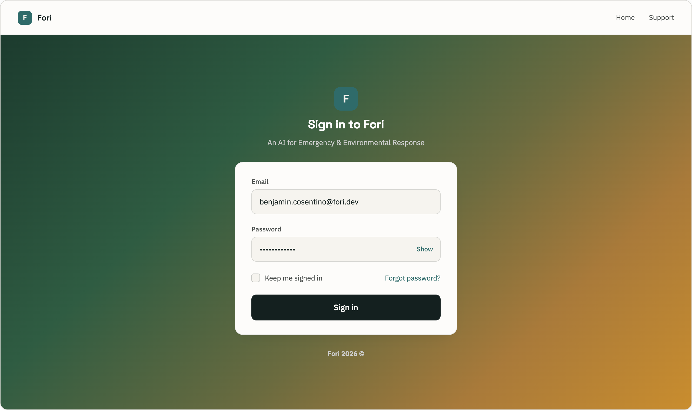
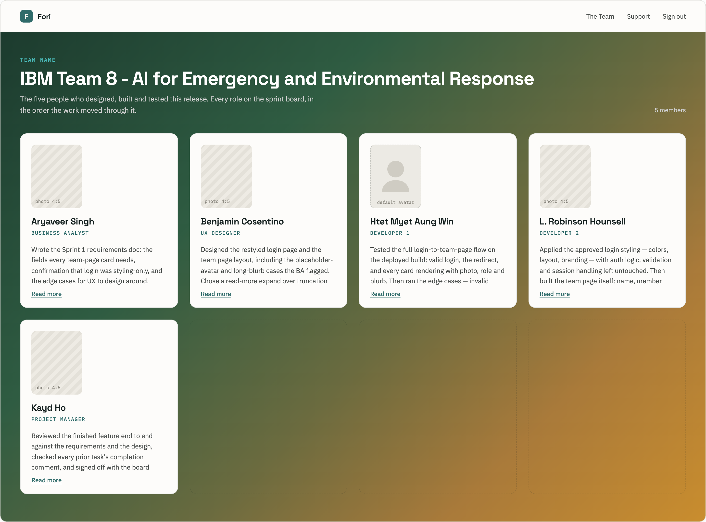
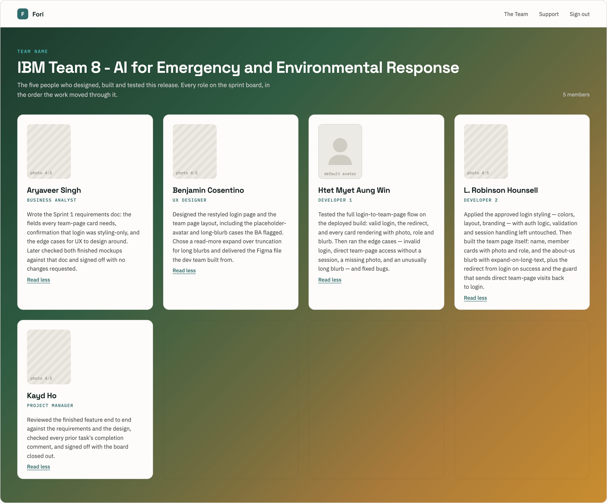

# UX Design

### Login Page -

### Team Page (Blurb truncated) - 

### Team Page (Blurb expanded) -

### Completion Comment of Designs:

Produced restyled mockups, the login mockup keeps existing fields, auth logic, validation and session handling untouched with a centrally aligned dialogue box, brand, key links in footer. The team page mockup is shown as automatic post-login landing page with card fields like name, role, photo, blurb. Includes edge cases, placeholder-avatar when missing photo, long blurb cases has ‘read more’ button instead of truncating and member count that isn’t multiple of four leaves empty grid slots. The final designs have been validated by the BA, all matching the requirements specified.