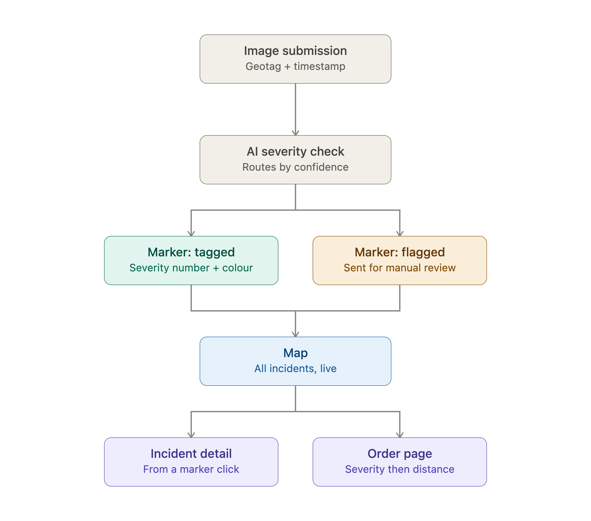

## Claude Design link for Low Fidelity Wireframes:
https://claude.ai/code/artifact/838d9756-9cd8-4c29-919f-182d0637b971

## User workflow diagram -

## Main User Journey

1. **Coordinator opens the Map** — sees existing incidents as colour/number-coded markers.
2. **New footage comes in** → they go to Image Submission → attach image + geotag + timestamp → invalid submissions are rejected with a message → valid ones confirm and show a processing state.
3. **AI returns a severity tag** → new marker appears on the Map without a reload. If the AI can't confidently assess it, it's flagged for manual review instead of getting a false tag.
4. **Coordinator clicks a marker** → Incident Detail → sees severity, exact location, and the reasoning behind the ranking.
5. **Coordinator checks the Order Page** → priority list (severity first, proximity second) with a reason per item → decides where to send crews.
6. **(Secondary, indirect) Field Response team** receives that decision relayed by the coordinator — no direct system interaction.

### Traceability

The main user journey has been created according to the information from the 6 Core User Needs, 10 Functional Requirements, and Acceptance Criteria Groups. Here is how it links:

**Step 1 — Coordinator opens Map, sees colour/number-coded markers**
- Core needs #1 & #2 (all reports in one place, severity visible at a glance)
- FR #4 & #5 (markers on map, distinguished by severity)
- AC #4 & #5 (markers appear at correct location, show severity number + distinct colour)

**Step 2 — Image Submission: attach image + geotag + timestamp → reject if missing → confirm valid submission**
- Core need #1 (need to submit reports)
- FR #1 (users attach geotagged, timestamped images)
- AC #1 (three sub-states: default form, validation error if geotag/timestamp missing, success confirmation before processing)

**Step 3 — AI processes: tags with severity OR flags for manual review (not false flags)**
- FR #2 (AI returns severity tag)
- FR #7 (map updates live without reload)
- FR #10 (unprocessable images displayed for manual review)
- AC #2 (auto-process, return tag, or flag if confidence fails)
- AC #7 (old incidents stay, new appear, no duplicates)

**Step 4 — Click marker → Incident Detail: shows severity, location, reasoning**
- Core needs #4 & #6 (tags must explain themselves, clarity for field teams)
- FR #3 & #6 (detailed report with locations/severity/time/status, clickable from marker)
- AC #3 (prominent fields)
- AC #6 (correct report, no delay)

**Step 5 — Order Page: priority list (severity first, proximity second) + reason per item**
- Core need #3 (system prioritises, removes manual sorting)
- FR #8 & #9 (chronological order by severity & location, explanation provided)
- AC #8 (order logic, live updates, visible as list)
- AC #9 (plain-language reasoning, not raw AI output)

**Step 6 — Field Response teams receive coordinator's relayed decision (indirect system use)**
- Target users section (secondary users interact indirectly, receive information from coordinator not system)
- Core need #6 (clarity so coordinators relay information to secondary users accurately)

 