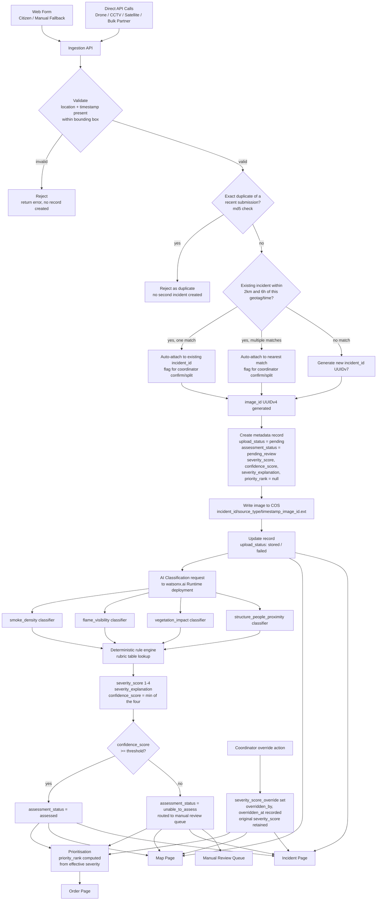

> **Archived 2026-09-24.** Historical record, kept as written. Current version: [Architecture](../../../live/architecture.md). Why things changed: [decision log](../../../decisions/decision-log.md).

# Technical Data-Flow / Architecture Diagram: Finalised

**Status:** DRAFT, extends the diagram already committed in `docs/Storage and metadata V2.md` Section 7
**Purpose:** The committed diagram already covers ingestion through storage correctly and marks AI classification and prioritisation as dashed, planned-but-not-implemented steps. This finalises those two steps plus the incident clustering decision and the coordinator override path, all now specified enough to draw solid rather than dashed, per AI_Framework_and_Technical_Approach.md and Storage_and_Metadata_Finalisation_Addendum.md.

### What changed versus the committed diagram

1. Step 3 (metadata record creation) now includes an incident clustering decision: auto-match against existing incidents by the spatial/temporal rule, per the confirmed hybrid (option C) grouping approach, rather than always creating a new incident.
2. Step 5 (AI classification) is expanded from a single black box node into the four indicator classifiers, the rule engine, and the confidence based routing decision that was always implied by `assessment_status` but not previously drawn.
3. Step 6 (prioritisation) now shows `priority_rank` computed from the effective severity (override-aware), not just the raw AI score.
4. A new coordinator override path is added, since US13/FR14 is an approved story the previous diagram predates.

### Notes

- The rule engine box is deliberately drawn as plain, non-ML logic, distinct from the four classifier boxes feeding it, this is the visual expression of the explainability decision (decompose into indicator flags, derive severity by a transparent rule rather than a single opaque model call).
- `confidence_score` is shown as the minimum across the four indicator classifiers' own confidences, per the recommendation in AI_Framework_and_Technical_Approach.md, so a low overall confidence can be traced back to whichever specific indicator was uncertain.
- The override path is drawn as always able to reach the Map, Incident and Order pages regardless of whether the image was auto-assessed or sent to manual review first, since a coordinator can override either outcome per US13.
- The duplicate check and clustering decision both sit before metadata record creation, consistent with the existing design principle that a metadata record is only created once a submission is known to be valid and not a rejected duplicate.
