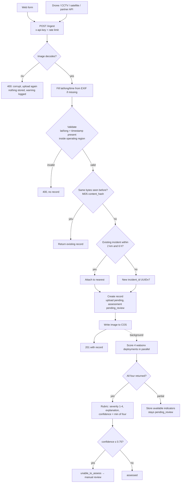

# Architecture and Data Flow

**Status:** Live. Describes what is built and deployed, with planned parts marked.
**Owner:** Liam Robinson Hounsell (Dev 2), Htet (Dev 1)
**Last updated:** 2026-09-25
**Supersedes:** [Storage and metadata V2](../archive/sprint-1/storage/Storage_and_metadata_V2.md) §1, 3, 7 · [Data-flow diagram](../archive/sprint-1/ai-ml/Technical_Data_Flow_Architecture_Finalised.md) · [Integration interface](../archive/sprint-1/ai-ml/Dataset_Integration_Interface_for_Htet.md)

---

## 1. Components

| Component | Tech | Where |
|---|---|---|
| Backend API | Express 5 + TypeScript, run directly by Node's type stripping (`node index.ts`) | IBM Code Engine app `assignment-1-backend` (ca-tor) |
| Frontend | Next.js | Code Engine app `assignment-1-frontend` (ca-tor). Currently a scaffold. |
| Image storage | IBM Cloud Object Storage, HMAC credentials | us cross-region endpoint (`s3.us.cloud-object-storage.appdomain.cloud`) |
| Metadata store | Postgres (Neon free project; swapping to IBM Cloud Databases for PostgreSQL is just changing `DATABASE_URL`) | Neon |
| Indicator models | Four small ONNX CNNs, one per rubric indicator | watsonx.ai Runtime deployment space (ca-tor) |

## 2. Upload to score

Notes:

- **The response doesn't wait for classification.** `/ingest` returns as soon as the image is stored. Scoring takes about 10 s and is written to the record afterwards. Clients read results from `/incidents` or `/order` (D-21).
- **Grouping** (2 km / 6 h, nearest wins) runs under a lock so two near-simultaneous uploads can't create two incidents. Coordinator confirm/split is not built.
- **Operating region** is a placeholder bounding box for Victoria, AU (lat -39.2 to -33.98, lon 140.96 to 150.03) in `validate.ts`.
- **Fire gate** is not built; every image is scored with `classification_label = fire` (D-22).
- **Prioritisation** (`priority_rank`) is not computed yet.
- **External classification service** (the Sprint 1 request/response contract, `CLASSIFICATION_SERVICE_URL`) was never built and its code has been removed; the direct watsonx deployments replaced it.

## 3. API

All routes except `/` and `/health` need an `x-api-key` header whose value is listed in `ALLOWED_API_KEYS` (`name:key,name:key`).

| Method | Path | Returns |
|---|---|---|
| GET | `/` | Liveness `{status: "ok"}` |
| GET | `/health` | Readiness, checks the database |
| POST | `/ingest` | Multipart: `image` (≤ 15 MB), `source_type` (`drone`/`cctv`/`citizen`/`satellite`), `latitude`, `longitude`, `timestamp`, optional `incident_id`. 201 with the new (or existing duplicate) record. |
| GET | `/incidents?minLat&maxLat&minLon&maxLon` | Records inside a map viewport (latest image per incident), each with the incident's `dispatchState` |
| GET | `/incidents/:incidentId` | Every image record in an incident, newest first, with `dispatchState` |
| GET | `/order` | All records by `priority_rank`, nulls last |
| GET | `/images/:imageId` | `{url}`: a signed, time-limited download link. **Only the link, not the record.** |
| POST | `/images/:imageId/assess` | Manual scoring: JSON with `classification_label`, the four indicator labels and `confidences`. Runs the rubric and saves the result. **`classifier` caller only.** |
| PATCH | `/images/:imageId/decision` | Coordinator review/override: any of `severityScoreOverride` (1–4 or null), `classificationLabelOverride` (label or null), `assessmentStatus` (`assessed`/`unable_to_assess`), plus `by`. Each changed field is logged. **`frontend` caller only.** |
| PUT | `/incidents/:incidentId/dispatch` | `{state: awaiting \| live \| extinguished, by}`: dispatch, cancel, extinguish, reopen. Logged. **`frontend` caller only.** |
| GET | `/incidents/:incidentId/decisions` | Decision log, newest first: field, from, to, who, when. **`frontend` caller only.** |

Cross-cutting:

- **Caller scopes:** a key's name (`frontend`, `classifier`, …) decides which write routes it may use; other keys get 403.
- **Rate limit:** per caller + client IP (the frontend proxy forwards the user's IP as `x-forwarded-for`): 600 reads (`GET`) and 60 writes per minute, counted separately, in memory per instance (up to 5 instances). Applied once to every keyed route. See D-29.
- **CORS:** only `FRONTEND_ORIGIN`; methods GET, POST, PUT, PATCH, OPTIONS.
- **No client ever holds a COS key.** Writes go through the API; reads use signed URLs.

## 4. Configuration

Backend environment (Code Engine secret `backend-secrets` in prod, `backend/.env` locally):

| Variable | Purpose |
|---|---|
| `DATABASE_URL` | Postgres connection |
| `COS_ENDPOINT`, `COS_BUCKET`, `COS_ACCESS_KEY_ID`, `COS_SECRET_ACCESS_KEY` | Image storage |
| `IBM_CLOUD_API_KEY`, `WATSONX_API_KEY` | IAM auth (the watsonx key owns the deployment space) |
| `WATSONX_REGION`, `WATSONX_PROJECT_ID`, `WATSONX_SPACE_ID` | watsonx location |
| `WATSONX_SMOKE_DENSITY_DEPLOYMENT_ID`, `WATSONX_FLAME_VISIBILITY_DEPLOYMENT_ID`, `WATSONX_VEGETATION_IMPACT_DEPLOYMENT_ID`, `WATSONX_INFRASTRUCTURE_IMPACT_DEPLOYMENT_ID` | One per indicator model. Unset = that indicator is skipped. Swapping a model is just changing the ID. |
| `ALLOWED_API_KEYS` | `name:key` pairs allowed to call the API |
| `FRONTEND_ORIGIN` | CORS origin (plain env var on the app, not in the secret) |

See [deployment and operations](deployment-and-operations.md) for how these are managed.
