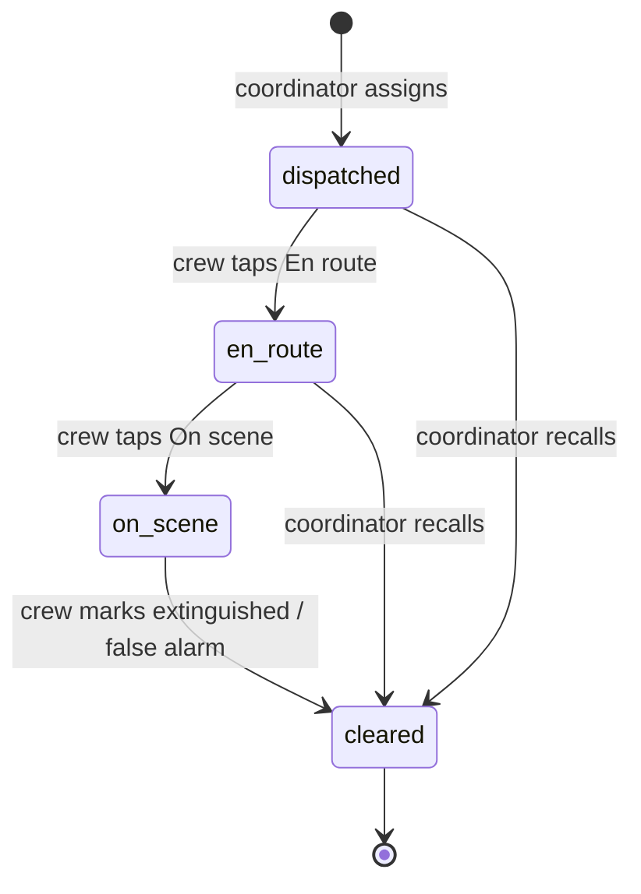

# Live Dispatch and Response Crews

**Status:** Live. Feature spec, agreed 2026-09-25, not yet built.
**Owner:** Liam Robinson Hounsell
**Last updated:** 2026-09-25

---

## 1. Summary

Today the coordinator can mark a fire "dispatched", but nobody is actually sent anywhere. This feature adds named response crews that the coordinator assigns to incidents. It also adds a crew screen where crews report status and outcome, and a shared live feed of comments and photos for each incident.

Goals:

- The coordinator sees which crew is on which fire and how far along each crew is: dispatched, en route or on scene.
- Crews report from the field: they mark the fire extinguished or a false alarm, update severity, request support and upload photos.
- Both screens update without a refresh, within about 5 s.
- Each incident shows its most recent image and rating, plus a gallery of all its images.
- The rate limit makes room for polling and thumbnails, and stays tight for writes.

## 2. What already exists

| Area | Today | Where |
|---|---|---|
| Dispatch state | One state per incident: `awaiting` → `live` → `extinguished` → `archived`. No crew attached. | `incident_dispatch` table, `PUT /incidents/:id/dispatch` |
| Audit log | Every coordinator change, with before/after, who, when | `decisions` table, `GET /incidents/:id/decisions` |
| Severity / false alarm | Per-image `severity_score_override` and `classification_label_override` (`non_fire` = discard). The AI's own values are never overwritten. | `PATCH /images/:id/decision` |
| Adding images to an incident | `/ingest` already accepts `incident_id` | `ingestion.routes.ts` |
| Latest image per incident | Map and order already use each incident's newest image (`DISTINCT ON … ORDER BY timestamp DESC`) | `findInBoundingBox` |
| All images per incident | `GET /incidents/:id` returns every image, newest first. The detail page only uses `images[0]`. | `getIncident` in `real/api.ts` |
| Live updates | None. The store loads once in `init()`. | `useIncidentStore` |
| Identity | None. `by` is a hardcoded string (`COORDINATOR_NAME`), recorded but not verified. The frontend proxy adds one shared API key. | `api-key.middleware.ts`, `coordinator.routes.ts` |
| Rate limit | 30 requests/min per caller and client IP, in memory on each instance | `rate-limit.middleware.ts` |

## 3. Screens

### Coordinator (extends Dispatch order and Incident detail)

- **Dispatch crew** opens a crew picker instead of flipping the state. The picker shows each available crew's label, type (light, heavy or aerial), station and distance to the fire. Crews already on another incident are not listed. You can pick one crew or several.
- Rows in the Live section show the assigned crews, each with a status chip (Dispatched / En route / On scene) and how long ago it changed. The existing **Mark extinguished** button is removed, because only crews close a fire. The coordinator keeps **Recall crew** and **Reopen** (for re-ignition).
- A **Crews** panel lists every crew with its status, station and current incident.
- Incident detail gets a live **activity feed**: comments, crew status changes, crew reports and new photos in one timeline, with a comment box at the bottom.
- **Support requests** from crews appear in the header alerts panel and as a badge on the incident. The coordinator responds by dispatching another crew or by dismissing the request.

### Response crew (new **Crew** tab in the header, `/crew`)

- For the demo, the Crew tab shows what a crew would see. A crew switcher at the top picks which crew you are viewing as. In a real product each crew would have its own login, but login is out of scope.
- The screen shows the crew's **current assignment**: place, severity, latest image and a directions link.
- Big status buttons, in order: **En route → On scene**.
- On-scene actions:
    - **Mark extinguished**
    - **False alarm**
    - **Update severity** (1–4)
    - **Request support**, with a crew type and a short note
    - **Add photo**, using the phone camera (`<input type="file" accept="image/*" capture>`)
- The same live activity feed and comment box as the coordinator.

## 4. Stations and crews

Crews work out of **stations** (firehouses). A station has a fixed location and several crews, and each crew has its own label and type. Assigning a crew to an incident creates an **assignment**. A crew with an open assignment can't be dispatched anywhere else.

| Type | Example |
|---|---|
| Light | Rapid response unit, 2 crew. Quick to check a citizen report. |
| Heavy | Tanker, 3–4 crew. The default first response. |
| Aerial | Water bomber or helicopter. For large or hard-to-reach fires. |

Example: Kinglake station has **Kinglake Light 1**, **Kinglake Heavy 1** and **Kinglake Heavy 2**. Distance in the crew picker is a straight line from the crew's station, and it replaces the single `STAGING_COORDS`.

Assignment lifecycle:



An assignment is cleared in one of three ways:

- the crew marks the fire extinguished
- the crew reports a false alarm
- the coordinator recalls the crew before it arrives

When a crew marks a fire extinguished or a false alarm, every crew on that incident is cleared together. The incident then moves to Resolved, or to the Archive for a false alarm. A crew is **available** again as soon as its assignment is cleared.

Incidents already `live` in the database have no crew attached, so no crew can close them. The coordinator cancels the dispatch and sends a crew again.

## 5. Incident actions

Most crew actions reuse endpoints that already exist. Every action is also written to `decisions`, recorded against the crew that made it.

| Action | Who | Backed by | New? |
|---|---|---|---|
| Dispatch crew(s) | Coordinator | `POST /incidents/:id/assignments`. Sets the incident to `live`. Rejected if the crew already has an open assignment. | New |
| En route / On scene | Crew | `PATCH /assignments/:id` `{status}` | New |
| Recall crew | Coordinator | `PATCH /assignments/:id` `{status: cleared}` | New |
| Mark extinguished | Crew only | Clears every assignment on the incident, `PUT /incidents/:id/dispatch` → `extinguished` | Reuse |
| False alarm | Crew only | `PATCH /images/:id/decision` `{classificationLabelOverride: non_fire}` on the latest image, then clears every assignment | Reuse |
| Reopen (re-ignition) | Coordinator | Existing reopen → `live`. A crew has to be dispatched again. | Reuse |
| Update severity | Crew or coordinator | `PATCH /images/:id/decision` `{severityScoreOverride}` on the latest image | Reuse |
| Request support | Crew | `POST /incidents/:id/support-requests` `{crewType, note}` | New |
| Comment | Both | `POST /incidents/:id/comments` `{body}` | New |
| Upload photo | Crew | `/ingest` with `incident_id`, `source_type` = new value `crew` | Reuse + one enum value |

- **Severity: the newest source wins.** A crew's update is another override on the latest image, and the next photo replaces it. Once on scene, the crew decides what is really happening by marking the fire extinguished or requesting support. The number on screen matters less.
- **Crew photos go through the AI pipeline** like any other image, so they get a rating and "most recent image and rating" still holds.
- New routes need to be added to the frontend proxy's `ALLOWED` list in `app/api/backend/[...path]/route.ts`.

## 6. Image gallery

The backend already returns every image for an incident, so this is almost all frontend work.

- Incident detail shows the **most recent image** as the main image, with its rating: severity band, confidence, source and age.
- Below the main image is a **thumbnail strip** of every image, newest first. It uses the existing `/images/:id/preview?w=240`, with a severity dot on each thumbnail. Tapping a thumbnail swaps the main image and its rating.
- `getIncidentImages(id)` replaces the unused `getIncident` and returns every image as its own normalised `Incident`, so each carries its own band and confidence. The store's copy of the incident stays first, so overrides show without a refetch.
- Dispatch rows and the crew assignment card show the latest thumbnail.

## 7. Rate limit

Decision: **split it by method** (D-29). The limit is still per caller + client IP, in `rate-limit.middleware.ts`:

| Kind | Limit | Why |
|---|---|---|
| Reads (`GET`) | 600/min | 5 s polling is 12/min per tab, and a 20-thumbnail gallery is 20 more. At the old 30/min, one app load (thumbnail preloads) nearly used the whole budget. |
| Writes (`POST`/`PATCH`/`PUT`) | 60/min | Clicks and crew uploads stay well under it. Each `/ingest` runs four watsonx calls and a COS write, so a flood is where the cost is. |

The frontend proxy keeps forwarding `x-forwarded-for`, since the limit is per client IP. Browsers behind one NAT (a classroom Wi‑Fi) share a budget: ten tabs polling is about 120 reads/min.

## 8. Data model

New tables in `schema.sql`, re-runnable, in the same style as the existing ones:

```sql
CREATE TABLE IF NOT EXISTS stations (
    station_id UUID PRIMARY KEY,
    name       TEXT NOT NULL UNIQUE,          -- "Kinglake"
    latitude   DOUBLE PRECISION NOT NULL,
    longitude  DOUBLE PRECISION NOT NULL
);

CREATE TABLE IF NOT EXISTS crews (
    crew_id    UUID PRIMARY KEY,
    station_id UUID NOT NULL REFERENCES stations,
    label      TEXT NOT NULL UNIQUE,          -- "Kinglake Heavy 1"
    crew_type  TEXT NOT NULL CHECK (crew_type IN ('light','heavy','aerial'))
);

CREATE TABLE IF NOT EXISTS assignments (
    assignment_id BIGSERIAL PRIMARY KEY,
    incident_id   UUID NOT NULL,
    crew_id       UUID NOT NULL REFERENCES crews,
    status        TEXT NOT NULL CHECK (status IN ('dispatched','en_route','on_scene','cleared')),
    updated_at    TIMESTAMPTZ NOT NULL DEFAULT now()
);
-- a crew can't be on two incidents at once: enforced by the database, not app code
CREATE UNIQUE INDEX IF NOT EXISTS one_open_assignment_per_crew
    ON assignments (crew_id) WHERE status <> 'cleared';

-- append-only, like decisions: no UPDATE or DELETE endpoint
CREATE TABLE IF NOT EXISTS comments (
    id          BIGSERIAL PRIMARY KEY,
    incident_id UUID NOT NULL,
    author      TEXT NOT NULL,
    body        TEXT NOT NULL CHECK (length(body) BETWEEN 1 AND 1000),
    created_at  TIMESTAMPTZ NOT NULL DEFAULT now()
);

CREATE TABLE IF NOT EXISTS support_requests (
    id          BIGSERIAL PRIMARY KEY,
    incident_id UUID NOT NULL,
    crew_id     UUID NOT NULL REFERENCES crews,
    crew_type   TEXT CHECK (crew_type IN ('light','heavy','aerial')),
    note        TEXT,
    status      TEXT NOT NULL DEFAULT 'open' CHECK (status IN ('open','fulfilled','dismissed')),
    created_at  TIMESTAMPTZ NOT NULL DEFAULT now()
);
```

Assignment status changes are also written to `decisions`, so the audit trail stays in one place. A seed script like `seed-demo.ts` creates about 3 stations with 2–3 crews each. There's no UI for managing crews.

## 9. Live updates: polling

Decision: **poll every 5 s** from one endpoint, `GET /activity?since=<iso>`. It returns every comment, assignment change, decision and new image since that time. The store merges these in. Only the open page polls.

Why not WebSockets:

- **The proxy can't carry them.** Every browser call goes through the Next.js route handler, which adds the API key on the server side. Route handlers can't pass through a WebSocket upgrade, so the browser would have to connect to the backend directly. That would expose the key, or we'd need a second auth scheme.
- **Updates only need to go one way.** Every write (dispatch, comment, status) is already a normal HTTP call. Only server-to-browser updates need pushing, and SSE (Server-Sent Events) handles that one-way case.
- **The backend runs several instances.** Code Engine runs up to 5 backend instances. An update written on one instance has to reach a browser connected to another, which needs Postgres `LISTEN/NOTIFY` or similar. Long-lived connections are also cut by Code Engine's request timeout, so they need reconnect logic.
- **In a demo it looks the same.** Within 5 s is live enough with a coordinator tab and a crew tab side by side.

Upgrade path if 5 s ever feels slow: SSE through the proxy plus `LISTEN/NOTIFY`, with the same `/activity` payload.

## 10. Decisions

| # | Question | Decision |
|---|---|---|
| 1 | How does a crew identify itself? | A **Crew** tab in the header, with a crew switcher standing in for each crew's login. Login is out of scope. |
| 2 | Whose severity wins, the crew's or the AI's? | The newest source. On scene, the crew makes the call by marking the fire extinguished or requesting support. |
| 3 | Latest or worst photo for incident severity? | Latest photo, as now. |
| 4 | Polling or WebSockets? | Polling every 5 s (§9). |
| 5 | Rate limit | 600 reads/min and 60 writes/min per caller + client IP (§7, D-29). |
| 6 | Several crews per incident? | Yes. A crew is tied to one incident until its assignment is cleared: extinguished, false alarm, or recalled. |
| 7 | Who marks a fire extinguished? | Crews only. The coordinator can reopen a fire after re-ignition. |
| 8 | Can comments be edited? | No. They are permanent and append-only, like a log. |
| 9 | Crew types | Light, heavy, aerial. A station holds several crews, each with its own label. |

The mock data source only covers what the demos and tests need.

## 11. Phasing

The work is split into four PRs. Each one works on its own.

| # | Scope | Size |
|---|---|---|
| 1 | Split the rate limit (600 reads / 60 writes per minute). Add the image gallery and each image's rating to incident detail. | S |
| 2 | Comments table and endpoint, `/activity` polling, and the activity feed on incident detail | M |
| 3 | `stations`, `crews` and `assignments` tables, a seed script, the crew picker on Dispatch, and crew chips on Live rows | M |
| 4 | Crew tab (`/crew`): status buttons, extinguish, false alarm, severity, photo upload, support requests and alerts | L |

Out of scope:

- Live GPS tracking of crews on the map
- Real authentication and roles
- Push notifications, SMS or radio integration
- Automatic crew recommendation. The picker sorts by distance instead.
- A UI for creating and editing crews
